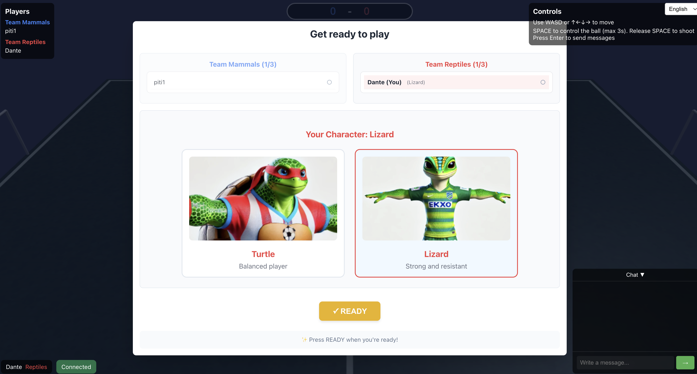

# Reptiles vs Mammals

A real-time multiplayer soccer game where two teams of anthropomorphic animals compete in an exciting match. Players can choose between Mammals (blue team) or Reptiles (red team) and select different animal characters with unique characteristics.

## Screenshots

### Character Selection


### Gameplay


### Demo


## Features

- **Real-time Multiplayer**: Play with friends in fast-paced matches.
- **Team-based Gameplay**: Choose between two teams:
  - **Mammals (Blue Team)**: Rabbit and Pig characters.
  - **Reptiles (Red Team)**: Turtle and Lizard characters.
- **Physics-based Ball Control**: Realistic ball physics with control mechanics.
- **In-game Chat**: Communicate with other players during matches.
- **Responsive Design**: Supports both desktop and mobile devices.
- **Internationalization**: Multi-language support (English and Spanish).
- **Score Tracking**: The first team to score 3 goals wins.

## Technologies Used

This project is structured as a monorepo with two main services: the frontend and the game-server.

- **Frontend**:
  - React: For building the user interface.
  - Babylon.js: For real-time 3D graphics rendering.
  - Socket.IO Client: For real-time communication with the server.

- **Backend (game-server)**:
  - Node.js / Express: For the web server.
  - Socket.IO: To handle WebSocket communication and multiplayer game logic.
  - @babylonjs/core: Used on the backend for vector and quaternion calculations, ensuring consistency with the frontend.

- **Orchestration & Deployment**:
  - Docker & Docker Compose: To containerize and run both the frontend and backend services easily.
  - Nginx: Used in the production Docker image to serve the static frontend build.

## Controls

### Desktop
- **Movement**: WASD or Arrow Keys
- **Control Ball**: Hold Spacebar to control the ball (max 3s).
- **Shoot**: Release Spacebar to shoot the ball.
- **Chat**: Press Enter to open the chat, and press it again to send the message.

### Mobile
- **Movement**: On-screen virtual joystick.
- **Control/Shoot Ball**: Dedicated on-screen button (hold to control, release to shoot).
- **Chat**: Tap the chat icon to expand and communicate.

## Getting Started

### Prerequisites
- Node.js (v18 or higher)
- npm or yarn
- Docker and Docker Compose (for the recommended method)
- A modern web browser with WebGL support.

### Installation

#### Method 1: Using Docker (Recommended)
This is the easiest way to get the entire environment up and running.

1) Clone the repository:
```bash
git clone https://github.com/PitiGo/frontend_futball_3d_online.git
cd frontend_futball_3d_online
```

2) Build and run the frontend and backend services with Docker Compose:
```bash
docker-compose up --build
```

3) Open your browser and navigate to http://localhost:3000.

#### Method 2: Manual Installation (For Development)
This method allows you to run the frontend and backend separately.

1) Clone the repository:
```bash
git clone https://github.com/PitiGo/frontend_futball_3d_online.git
cd frontend_futball_3d_online
```

2) Start the Server (Backend):
Open a terminal, navigate to the game-server folder, install dependencies, and start the server.
```bash
cd game-server
npm install
npm run dev
```
The game server will be listening on http://localhost:4000.

3) Start the Client (Frontend):
Open a new terminal, navigate to the frontend folder, install dependencies, and start the React application.
```bash
cd frontend
npm install
npm start
```
The React application will start on http://localhost:3000.

Open your browser and navigate to http://localhost:3000 to play.

## Gameplay

1. Enter your name to join the game.
2. Select your team (Mammals or Reptiles).
3. Choose your character.
4. Click "READY" when you're prepared to play.
5. The game starts when all players are ready.
6. The first team to score 3 goals wins!

## Game Mechanics

- Players can control the ball by holding the control button.
- Ball control is limited to a maximum of 3 seconds.
- Physics-based collisions and momentum transfer.
- Team coordination is key to victory.
- Strategic positioning and passing are essential.

## Contributing

Contributions are welcome! Please follow these steps:

1. Fork the repository.
2. Create your feature branch (`git checkout -b feature/AmazingFeature`).
3. Commit your changes (`git commit -m 'Add some AmazingFeature'`).
4. Push to the branch (`git push origin feature/AmazingFeature`).
5. Open a Pull Request.

## License

This project is licensed under the MIT License - see the LICENSE.md file for details.

## Support

For support, please open an issue in the GitHub repository.